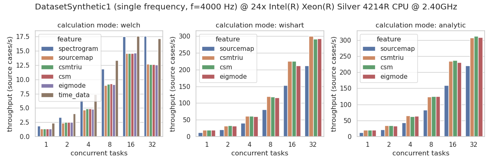
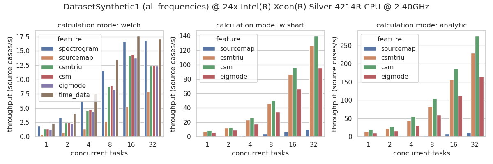

================================================================================
AcouPipe
================================================================================

**AcouPipe** is a Python toolbox for generating unique acoustical source localization and characterization datasets with Acoular_ that can be used for training of deep neural networks and machine learning. 

AcouPipe supports distributed computation with Ray_ and comes with two default datasets, which enables to create data for machine learning on the fly! A pre-built Docker container can be downloaded from DockerHub_.

The toolbox **documentation** can be found `here <https://adku1173.github.io/acoupipe/>`_.

Datasets 
===============

Currently, AcouPipe provides two default classes to generate microphone array datasets:

* **DatasetSynthetic** is a simple and fast method that relies on synthetic white noise signals and spatially stationary sources in anechoic conditions. 

.. figure:: sphinx/source/_static/msm_layout.png
   :width: 600
   :align: center

* **DatasetMIRACLE** relies on a large-scale set of measured spatial room impulse responses from the `MIRACLE dataset <https://depositonce.tu-berlin.de/items/b079fd1c-999f-42cb-afd2-bcd34de6180b>`_, acquired at the TU Berlin anechoic chamber, and synthetic source signals resulting in a realistic and quasi-infinite dataset.

.. figure:: sphinx/source/_static/msm_miracle.png
   :width: 600
   :align: center

Data Generation 
===============

Instead of raw time-data, only the necessary input features for machine learning are stored.

This allows the user to create data sets of manageable size that are portable, or even to create data on the fly, and facilitate reproducible research.

See the latest performance benchmarks on `DatasetSynthetic` for the most computational demanding features:

Citation 
========

Users can cite the package in their contributions by referring to `Kujawski and Sarradj, (2023) <https://doi.org/10.1007/s11042-023-16947-w>`_:

.. code-block:: 

   @article{Kujawski2023,
   author = {Kujawski,Adam and Pelling, Art J. R. and Jekosch, Simon and Sarradj,Ennes},
   title = {A framework for generating large-scale microphone array data for machine learning},
   journal = {Multimedia Tools and Applications},
   year = {2023},
   doi = {10.1007/s11042-023-16947-w}
   }

License
=======

AcouPipe is licensed under the terms of the BSD license. See the file "LICENSE" for more information.

.. Links:
.. _SLURM: https://slurm.schedmd.com/quickstart.html
.. _Singularity: https://sylabs.io/guides/3.0/user-guide/quick_start.html
.. _Ray: https://docs.ray.io/en/master/
.. _`Ray Cluster`: https://docs.ray.io/en/master/cluster/index.html
.. _Tensorflow: https://www.tensorflow.org/
.. _`Tensorflow Dataset API`: https://www.tensorflow.org/api_docs/python/tf/data/Dataset#from_generator
.. _TFRecord: https://www.tensorflow.org/tutorials/load_data/tfrecord
.. _DockerHub: https://hub.docker.com/r/adku1173/acoupipe/tags?page=1&ordering=last_updated
.. _Acoular: http://www.acoular.org
.. _HDF5: https://portal.hdfgroup.org/display/HDF5/HDF5
.. _Pandas: https://pandas.pydata.org/docs/
.. _h5py: https://docs.h5py.org/en/stable/
.. _tqdm: https://github.com/tqdm/tqdm

