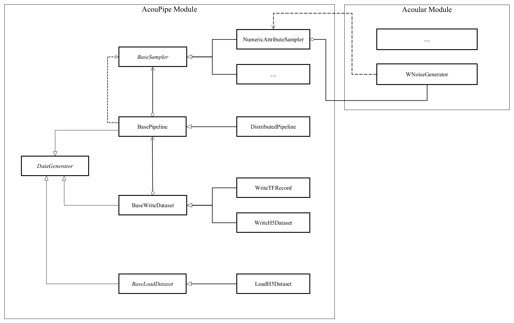

================================================================================
AcouPipe
================================================================================

**AcouPipe** is an easy-to-use Python toolbox for generating unique acoustical source localization and characterization data sets with Acoular_ that can be used for training of deep neural networks and machine learning. Instead of raw time-data, only the necessary input features for acoustical beamforming are stored, which include:

* Cross-Spectral Matrix / non-redundant Cross-Spectral Matrix (e.g. in [Cas21]_)
* Conventional Beamforming Map (e.g. in [Kuj19]_)

This allows the user to create data sets of manageable size that are portable and facilitate reproducible research.

AcouPipe supports distributed computation with Ray_ and comes with a default configuration data set inside a pre-built Docker container that can be downloaded from DockerHub_.

.. toctree::
   :maxdepth: 2

	      dependency

Dependencies
=============
This package depends on the acoustical beamforming library Acoular_.
   

Quickstart
==========
This section will walk you through the necessary steps to quickly generate the default data set.
The data set comprises:

* 500,000 source cases for training 
* 10,000 source cases for validation

The data set is created by a simulation process with Acoular_. The amount of cases can be easily extended. 
The following figure illustrates the virtual measurement setup.

.. figure:: docs/source/_static/msm_layout.png

Simulation with Docker
---------------------------------

The easiest way to create the data set is by using an existing
Docker image from DockerHub_. Simply pull the latest image with the command

.. code-block:: 

    docker pull adku1173/acoupipe:latest

The image contains the simulation source code and an up-to-date version of Acoular_, 
AcouPipe and Tensorflow_.
One can run the data set simulation given by the main.py script from inside the Docker container by typing

.. code-block:: 

    HOSTDIR="<enter the desired host directory>" # stores the data sets inside this directory
    NTASKS=<enter the number of parallel tasks> # should match the number of CPUs on the host
    docker run -it --user "$(id -u)":"$(id -g)" -v $HOSTDIR:/data/datasets adku1173/acoupipe python main.py --tasks=$NTASKS

Note that the current user on the host is specified as the user of the docker environment with the additional argument :code:`--user "$(id -u)":"$(id -g)"`.
It is not recommended to run the container as a root user.
Further, a directory where the data set files are stored needs to be binded to the container (:code:`HOSTDIR=<dir>`). With the 
:code:`HOSTDIR=$(pwd)` command, the current working directory on Linux or macOS hosts are binded. 
The simulation can be run on multiple CPU threads in parallel to speed up computations. The exact number of threads can be specified by the 
user with the :code:`--tasks` argument. 

After starting the main script, a progress bar should appear that logs the current simulation status:

.. code-block:: 

    1%|█▍                           | 83/10000 [01:04<1:40:35,  1.64it/s]

It is possible to view the CPU usage via a dashboard application served by the Ray_ API. One should find the following output at the beginning 
of the simulation process when running the simulation on multiple CPU threads

.. code-block:: 

    2021-05-14 08:50:16,533	INFO services.py:1267 -- View the Ray dashboard at http://0.0.0.0:8265

It is necessary to forward the corresponding TCP port with :code:`docker run -p 8265:8265 ...` at the start-up of the container to access the server serving the dashboard.
One can open the dashboard by accessing the web address http://0.0.0.0:8265 which should display the following web interface

.. image:: docs/source/_static/dashboard.png

The main.py script has some further command line options that can be used to influence the simulation process:

.. sidebar:: command line arguments of the main.py script

    .. code-block::

        usage: main.py [-h]
                    [--datasets {training,validation} [{training,validation} ...]]
                    [--tsamples TSAMPLES] [--tstart TSTART] [--vsamples VSAMPLES]
                    [--vstart VSTART] [--tpath TPATH] [--vpath VPATH]
                    [--file_format {tfrecord,h5}] [--cache_dir CACHE_DIR]
                    [--freq_index FREQ_INDEX] [--nsources NSOURCES]
                    [--features {sourcemap,csmtriu,csm} [{sourcemap,csmtriu,csm} ...]]
                    [--tasks TASKS] [--head HEAD] [--cache_csm] [--cache_bf]
                    [--log]

        optional arguments:
        -h, --help            show this help message and exit
        --datasets {training,validation} [{training,validation} ...]
                                Whether to compute both data sets ('training
                                validation') or only the 'training' / 'validation'
                                data set. Defaults to compute training and validation
                                data set
        --tsamples TSAMPLES   Total number of training samples to simulate
        --tstart TSTART       Start simulation at a specific sample of the data set
        --vsamples VSAMPLES   Total number of validation samples to simulate
        --vstart VSTART       Start simulation at a specific sample of the data set
        --tpath TPATH         Path of simulated training data. Default is current
                                working directory
        --vpath VPATH         Path of simulated validation data. Default is current
                                working directory
        --file_format {tfrecord,h5}
                                Desired file format to store the data sets.
        --cache_dir CACHE_DIR
                                Path of cached data. Default is current working
                                directory
        --freq_index FREQ_INDEX
                                Returns only the features and targets for the
                                specified frequency index, default is None (all
                                frequencies will be calculated and included in the
                                data set)
        --features {sourcemap,csmtriu,csm} [{sourcemap,csmtriu,csm} ...]
                                Whether to compute data set containing the csm or the
                                beamforming map as the main feature. Default is 'csm'
        --tasks TASKS         Number of asynchronous tasks. Defaults to '1' (non-
                                distributed)
        --head HEAD           IP address of the head node in the ray cluster. Only
                                necessary when running in distributed mode.
        --cache_csm           Whether to cache the results of the CSM calculation
        --cache_bf            Whether to cache the results of the beamformer
                                calculation. Only relevant if 'sourcemap' is included
                                in --features list.

Simulation on a High-Performance Cluster (HPC)
-----------------------------------------------

If you plan to simulate the data by means of multiple machines (e.g. on a high-performance cluster (HPC))
you can use the `Ray Cluster`_ interface.

The following code snippet gives an example of a job script that can
be scheduled with the SLURM_ job manager and by using a Singularity_ image. 

.. code-block:: bash

    #!/bin/bash
    #SBATCH --job-name=acoupipe_dataset
    #SBATCH --cpus-per-task=16 
    #SBATCH --nodes=4
    #SBATCH --tasks-per-node=1 # Give all resources to a single Ray task, ray can manage the resources internally
    #SBATCH --output=acoupipe_dataset.stdout

    DIRPATH=<path-to-the-acoupipe-dataset-folder>
    IMGNAME=<name-of-the-singularity-image> 

    let "worker_num=(${SLURM_NTASKS} - 1)" ### The variable $SLURM_NTASKS gives the total number of cores requested in a job. (tasks-per-node * nodes)-1 
    echo "Number of workers" $worker_num

    # Define the total number of CPU cores available to ray
    let "total_cores=${worker_num} * ${SLURM_CPUS_PER_TASK}"

    suffix='6379'
    ip_head=`hostname`:$suffix
    export ip_head # Exporting for latter access by trainer.py
    echo $ip_head

    # Start the ray head node on the node that executes this script by specifying --nodes=1 and --nodelist=`hostname`
    # We are using 1 task on this node and 5 CPUs (Threads). Have the dashboard listen to 0.0.0.0 to bind it to all
    # network interfaces. This allows to access the dashboard through port-forwarding:
    # z. B.: ssh -N -f -L 8265:10.254.1.100:8265 kujawski@130.149.110.144 
    srun --nodes=1 --ntasks=1 --cpus-per-task=${SLURM_CPUS_PER_TASK} --nodelist=`hostname` singularity exec -B $DIRPATH $IMGNAME ray start --head --block --dashboard-host 0.0.0.0 --port=6379 --num-cpus ${SLURM_CPUS_PER_TASK} &
    sleep 10

    # Now we execute worker_num worker nodes on all nodes in the allocation except hostname by
    # specifying --nodes=${worker_num} and --exclude=`hostname`. Use 1 task per node, so worker_num tasks in total
    # (--ntasks=${worker_num}) and 5 CPUs per task (--cps-per-task=${SLURM_CPUS_PER_TASK}).
    srun --nodes=${worker_num} --ntasks=${worker_num} --cpus-per-task=${SLURM_CPUS_PER_TASK} --exclude=`hostname` singularity exec -B $DIRPATH $IMGNAME ray start --address $ip_head --block --num-cpus ${SLURM_CPUS_PER_TASK} &
    sleep 10

    singularity exec -B $DIRPATH $IMGNAME python -u $DIRPATH/main.py --head=${ip_head} --tasks=${total_cores}

Data Set Characteristics
-------------------------

**fixed characteristics:**

===================== ========================================  
Environment           Unechoic, Resting, Homogeneous Fluid
Microphone Array      Vogel's spiral, M=64, Aperture Size 1m
Observation Area      x,y in [-0.5,0.5], z=0.5
Source Type           Monopole 
Source Signals        Uncorrelated White Noise (T=5s)
Sampling Rate         He = 40, Fs=13720 Hz 
No. of Time Samples   68.600 
===================== ========================================

**sampled characteristics:**

==================================================================   ===================================================  
Sensor Position Deviation [m]                                        Normal distributed (sigma = 0.001)
No. of Sources                                                       Poisson distributed (lambda=3)
Source Positions                                                     Normal distributed (sigma = 0.1688) 
Source Strength (Pa^2 at reference microphone)                       Rayleigh distributed (sigma_R=5)
==================================================================   ===================================================

Input Features
~~~~~~~~~~~~~~~~~~~~~~~~~~~~~

One can save one of the three different input features to file:

* **Cross-Spectral Matrix (CSM):** :code:`'csm'` of shape: (65,64,64,2)
* **non-redundant Cross-Spectral Matrix:** :code:`'csmtriu'` of shape: (65,64,64)
* **Conventional Beamforming Map:** :code:`'sourcemap'` of shape: (65,51,51)

The first axis of each feature corresponds to the FFT coefficient. The non-redundant CSM follows the 
approach stated in [Cas21]_ (the conjugate complex of the normal CSM is neglected). 
The underlying processing parameters used to calculate the CSM and/or the source map are:

===================== ========================================  
Block size            128 samples
Block overlap         50 %
Windowing             von Hann / Hanning
Steering vector       fromulation 3, see [Sar12]_
Evaluation basis      single frequency coefficient
===================== ========================================

with the following FFT frequency indices, frequencies and Helmholtz numbers:

+-------+----------------+------------------+
| Index | Frequency [Hz] | Helmholtz Number |
+-------+----------------+------------------+
| 0     | 0.0            | 0.0              |
+-------+----------------+------------------+
| 1     | 107.1875       | 0.3125           |
+-------+----------------+------------------+
| 2     | 214.375        | 0.625            |
+-------+----------------+------------------+
| 3     | 321.5625       | 0.9375           |
+-------+----------------+------------------+
| 4     | 428.75         | 1.25             |
+-------+----------------+------------------+
| 5     | 535.9375       | 1.5625           |
+-------+----------------+------------------+
| 6     | 643.125        | 1.875            |
+-------+----------------+------------------+
| 7     | 750.3125       | 2.1875           |
+-------+----------------+------------------+
| 8     | 857.5          | 2.5              |
+-------+----------------+------------------+
| 9     | 964.6875       | 2.8125           |
+-------+----------------+------------------+
| 10    | 1071.875       | 3.125            |
+-------+----------------+------------------+
| 11    | 1179.0625      | 3.4375           |
+-------+----------------+------------------+
| 12    | 1286.25        | 3.75             |
+-------+----------------+------------------+
| 13    | 1393.4375      | 4.0625           |
+-------+----------------+------------------+
| 14    | 1500.625       | 4.375            |
+-------+----------------+------------------+
| 15    | 1607.8125      | 4.6875           |
+-------+----------------+------------------+
| 16    | 1715.0         | 5.0              |
+-------+----------------+------------------+
| 17    | 1822.1875      | 5.3125           |
+-------+----------------+------------------+
| 18    | 1929.375       | 5.625            |
+-------+----------------+------------------+
| 19    | 2036.5625      | 5.9375           |
+-------+----------------+------------------+
| 20    | 2143.75        | 6.25             |
+-------+----------------+------------------+
| 21    | 2250.9375      | 6.5625           |
+-------+----------------+------------------+
| 22    | 2358.125       | 6.875            |
+-------+----------------+------------------+
| 23    | 2465.3125      | 7.1875           |
+-------+----------------+------------------+
| 24    | 2572.5         | 7.5              |
+-------+----------------+------------------+
| 25    | 2679.6875      | 7.8125           |
+-------+----------------+------------------+
| 26    | 2786.875       | 8.125            |
+-------+----------------+------------------+
| 27    | 2894.0625      | 8.4375           |
+-------+----------------+------------------+
| 28    | 3001.25        | 8.75             |
+-------+----------------+------------------+
| 29    | 3108.4375      | 9.0625           |
+-------+----------------+------------------+
| 30    | 3215.625       | 9.375            |
+-------+----------------+------------------+
| 31    | 3322.8125      | 9.6875           |
+-------+----------------+------------------+
| 32    | 3430.0         | 10.0             |
+-------+----------------+------------------+
| 33    | 3537.1875      | 10.3125          |
+-------+----------------+------------------+
| 34    | 3644.375       | 10.625           |
+-------+----------------+------------------+
| 35    | 3751.5625      | 10.9375          |
+-------+----------------+------------------+
| 36    | 3858.75        | 11.25            |
+-------+----------------+------------------+
| 37    | 3965.9375      | 11.5625          |
+-------+----------------+------------------+
| 38    | 4073.125       | 11.875           |
+-------+----------------+------------------+
| 39    | 4180.3125      | 12.1875          |
+-------+----------------+------------------+
| 40    | 4287.5         | 12.5             |
+-------+----------------+------------------+
| 41    | 4394.6875      | 12.8125          |
+-------+----------------+------------------+
| 42    | 4501.875       | 13.125           |
+-------+----------------+------------------+
| 43    | 4609.0625      | 13.4375          |
+-------+----------------+------------------+
| 44    | 4716.25        | 13.75            |
+-------+----------------+------------------+
| 45    | 4823.4375      | 14.0625          |
+-------+----------------+------------------+
| 46    | 4930.625       | 14.375           |
+-------+----------------+------------------+
| 47    | 5037.8125      | 14.6875          |
+-------+----------------+------------------+
| 48    | 5145.0         | 15.0             |
+-------+----------------+------------------+
| 49    | 5252.1875      | 15.3125          |
+-------+----------------+------------------+
| 50    | 5359.375       | 15.625           |
+-------+----------------+------------------+
| 51    | 5466.5625      | 15.9375          |
+-------+----------------+------------------+
| 52    | 5573.75        | 16.25            |
+-------+----------------+------------------+
| 53    | 5680.9375      | 16.5625          |
+-------+----------------+------------------+
| 54    | 5788.125       | 16.875           |
+-------+----------------+------------------+
| 55    | 5895.3125      | 17.1875          |
+-------+----------------+------------------+
| 56    | 6002.5         | 17.5             |
+-------+----------------+------------------+
| 57    | 6109.6875      | 17.8125          |
+-------+----------------+------------------+
| 58    | 6216.875       | 18.125           |
+-------+----------------+------------------+
| 59    | 6324.0625      | 18.4375          |
+-------+----------------+------------------+
| 60    | 6431.25        | 18.75            |
+-------+----------------+------------------+
| 61    | 6538.4375      | 19.0625          |
+-------+----------------+------------------+
| 62    | 6645.625       | 19.375           |
+-------+----------------+------------------+
| 63    | 6752.8125      | 19.6875          |
+-------+----------------+------------------+
| 64    | 6860.0         | 20.0             |
+-------+----------------+------------------+

Labels
~~~~~~~~~~~~~~~~~~~~~~~~~~~~~

The data set comprises labels for each source case:

**Source strength at the reference microphone:** :code:`'p2'`

The averaged squared sound pressure value at the reference microphone position (red dot) is
stored as an estimate of the source strength for each individual source and 65 FFT coefficients.
A value of zero is stored for non-existing sources. With a maximum number of 16 possible sources, this results 
in an array of shape (65,16) per case. 
It should be noted that the entries are sorted in descending order according to the overall RMS value of the source signal. 
The descending order is not strictly maintained when only a single frequency coefficient is considered.

**Source location:** :code:`'loc'`

The location in the x,y plane of each source is stored. Non-existing source locations are set to zero (center of the plane).
The source location array is of shape (16,2). The source ordering is the same as for the source strength estimate :code:`p2`.

**Number of sources:** :code:`'nsources'`

An integer providing the number of sources.

**Sample index:** :code:`'idx'`

The index referencing the sampled case in the data set (starts at 1). 

**Involved random seeds:** :code:`'seeds'`

A list with random seeds for each object that performs a random sampling of data set properties.
The combination is unique for each source case in the data set. This enables to re-simulate every 
specific sample of the data set. 

File Formats
~~~~~~~~~~~~~~~~~~~~~~~~~~~~~

The user can save the data to two different file formats (HDF5_ or TFRecord_). 
It is recommended to use the .h5 file format.

**HDF5 format**

HDF5_ is a container-like format storing data in hierarchical order. 
Each case and the corresponding data is stored into a separate group of the file. 
The sample index acts as the group header. 
An additional :code:`metadata` group includes important metadata (e.g. sampling frequency, FFT block size, ...).

.. code-block:: bash

    └──'1'
        |── 'csm' (or 'sourcemap', or 'csmtriu') 
        |── 'loc' 
        |── 'p2'  
        |── 'nsources'
        |── 'seeds'
    └──'2'
        |── 'csm' 
        |── 'loc' 
        |── 'p2'  
        |── 'nsources'
        |── 'seeds'
    └──...
        |   ...
        |  
    └──'metadata'
        |   'sample_freq'
        |   ...

Correct order is always maintained.  
This is important when multiple source cases are simulated in parallel tasks.

**TFRecord format**

The TFRecord_ file format is a binary file format to store sequences of data developed by Tensorflow_. 
In case of running the simulation with multiple CPU threads, the initial sampling order of the source cases may not be maintained in the file. 
The exact case number can be reconstructed with the :code:`idx` and :code:`seeds` features when the file is parsed.

Load the Data Set
------------------

**HDF5 format**

The AcouPipe toolbox provides the :code:`LoadH5Dataset` class to load the data sets stored into HDF5 format:

.. code-block:: Python

    from acoupipe import LoadH5Dataset

    dataset = LoadH5Dataset(name="<data-set.h5>")

    s1 = dataset.dataset['1'] # returns the first sample of the data set

    print(dataset.metadata) # prints the corresponding metadata information

A Python generator can be created which can be consumed by the `Tensorflow Dataset API`_:

.. code-block:: Python

    import tensorflow as tf

    data_generator = dataset.get_dataset_generator(
                features=['loc','nsources','p2','csmtriu','idx'], # the desired features to return from the file
                )

    # provide the signature of the features
    output_signature = {
                'loc' : tf.TensorSpec(shape=(16,2), dtype=tf.float32),
                'nsources':tf.TensorSpec(shape=(),dtype=tf.int64),
                'idx':tf.TensorSpec(shape=(),dtype=tf.int64),
                'p2' : tf.TensorSpec(shape=(16,), dtype=tf.float32),
                'csmtriu':  tf.TensorSpec(shape=(64,64), dtype=tf.float32),
                }

    dataset = tf.data.Dataset.from_generator(
                generator=data_generator,
                output_signature=output_signature
                )

    dataset_iter = iter(dataset)
    dataset_sample = next(dataset_iter) # return samples iteratively

**TFRecord format**

To parse the data from TFRecord files it is necessary to write a custom function that parses the file sequentially
(see: TFRecord_ documentation for details).

A potential parser function for the :code:`'csmtriu'` feature can be similar to:

.. code-block:: Python

    def tfrecord_parser_csmtriu(record):
        """ parser for tfrecord datasets with 'csmtriu' feature """
        parsed = tf.io.parse_single_example(
            record, 
            {
            'csmtriu': tf.io.VarLenFeature(tf.float32),
            'p2': tf.io.VarLenFeature(tf.float32),
            'loc' : tf.io.VarLenFeature(tf.float32),
            'nsources' : tf.io.FixedLenFeature((),tf.int64),
            }
        )
        # get and reshape parsed data
        csmtriu = tf.reshape(tf.sparse.to_dense(parsed['csmtriu']),shape=(65,64,64,1))
        p2 = tf.reshape(tf.sparse.to_dense(parsed['p2']),shape=(65,16))
        loc = tf.reshape(tf.sparse.to_dense(parsed['loc']),[-1,2])  
        nsources = tf.cast(parsed['nsources'],tf.int32)
        return (csmtriu, p2, loc, nsources)

Documentation
=================

The AcouPipe module extends the computational 
pipeline-based concept of Acoular_ and provides additional 
tools that can be helpful to generate realizations 
of features in a predefined random process. 

Installation
------------------

Module Overview
------------------

The following UML flowchart gives a rough overview of AcouPipe's 
classes and their inheritance relationships. 

Sampler Module
~~~~~~~~~~~~~~~~~~~~~~~~~~~~~

A manipulation of object characteristics according to a certain 
random distribution can be achieved by the use of the :code:`BaseSampler` derived classes included in the :code:`sampler.py` module. 
All :code:`BaseSampler` derived classes are representing random processes that can be used to manipulate the attributes of Acoular's objects according to a specified distribution. 
A random process is defined by a random variable and a corresponding random state. Both properties are attributes of all :code:`BaseSampler` derived classes. 
AcouPipe offers a variety of different types of samplers in the :code:`sampler.py` module.
The random variable that can be passed to class instances of the sampler module must be an derived from or be part of the :code:`scipy.stats` module. 

This example illustrates how the RMS value of two white noise signals can be sampled according to a normal distribution. Therefore, an instance of the :code:`BaseSampler` 
derived :code:`NumericAttributeSampler` class is used. The two white noise signal objects are given as targets to the sampler object. 
New RMS values following a normal distribution are assigned to the :code:`WNoiseGenerator` objects each time the sample method of the :code:`NumericAttributeSampler` object is evaluated.    

.. code-block:: python

    import acoular
    import acoupipe
    from scipy.stats import norm

    random_var = norm(loc=1.,scale=.5)

    n1 = acoular.WNoiseGenerator( sample_freq=24000, 
                    numsamples=24000*5, 
                    rms=1.0,
                    seed=1 )

    n2 = acoular.WNoiseGenerator( sample_freq=24000, 
                    numsamples=24000*5, 
                    rms=.5,
                    seed=2 )

    rms_sampler = acoupipe.NumericAttributeSampler(
                    target=[n1,n2],
                    attribute='rms',
                    random_var=random_var,
                    random_state=10)

    rms_sampler.sample()

Pipeline Module
~~~~~~~~~~~~~~~~~~~~~~~~~~~~~    

Classes defined in the :code:`pipeline.py` module have the ability to iteratively perform tasks on the related computational pipeline to build up a data set. 
The results of these tasks are the features (and labels) associated with a specific sample of the data set. 
Feature creation tasks can be specified by passing callable functions that are evoked at each iteration of the :code:`BasePipeline`'s :code:`get_data()` generator method. 
It is worth noting that such a data generator can also be used directly to feed a machine learning model without saving the data to file. 
Common machine learning frameworks, such as Tensorflow_, offer the possibility to consume data from Python generators.
Control about the state of the sampling process is maintained via the :code:`sampler` attribute holding a list of :code:`BaseSampler` derived instances. 

.. code-block:: python

    def calculate_csm(powerspectra):
        return powerspectra.csm

    pipeline = acoupipe.BasePipeline(
        sampler=[rms_sampler],
        numsamples = 5,
        features={'csm' : (calculate_csm, ps),}
        )
            
    data_generator = pipeline.get_data()

Writer Module
~~~~~~~~~~~~~~~~~~~~~~~~~~~~~
Provides classes to store the data extracted by the pipeline. 
Current implementation includes a classes to save data into a 
container-like file format (.h5 file with the :code:`WriteH5Dataset` class) or binary format (.tfrecord file with the :code:`WriteTFRecord` class). 
The latter can be efficiently consumed by the Tensorflow framework for machine learning.

.. code-block:: python

    file_writer = acoupipe.WriteH5Dataset(
                source=pipeline,
                )
        
    file_writer.save()
    

Loader Module
~~~~~~~~~~~~~~~~~~~~~~~~~~~~~
The :code:`loader.py` module provides the :code:`LoadH5Dataset` class to load the data sets stored into .h5 files.

Examples
------------------

.. Links:

.. _SLURM: https://slurm.schedmd.com/quickstart.html
.. _Singularity: https://sylabs.io/guides/3.0/user-guide/quick_start.html
.. _Ray: https://docs.ray.io/en/master/
.. _`Ray Cluster`: https://docs.ray.io/en/master/cluster/index.html
.. _Tensorflow: https://www.tensorflow.org/
.. _`Tensorflow Dataset API`: https://www.tensorflow.org/api_docs/python/tf/data/Dataset#from_generator
.. _TFRecord: https://www.tensorflow.org/tutorials/load_data/tfrecord
.. _DockerHub: https://hub.docker.com/r/adku1173/acoupipe/tags?page=1&ordering=last_updated
.. _Acoular: http://www.acoular.org
.. _HDF5: https://portal.hdfgroup.org/display/HDF5/HDF5

Literature
==========================

.. [Sar12] Sarradj, Ennes: Three-dimensional acoustic source mapping with different beamforming steering vector formulations. Advances in Acoustics and Vibration, pages 1–12, 2012.
.. [Cas21] Paolo Castellini, Nicola Giulietti, Nicola Falcionelli, Aldo Franco Dragoni, Paolo Chiariotti, A neural network based microphone array approach to grid-less noise source localization, Applied Acoustics, Volume 177, 2021, 107947, ISSN 0003-682X, https://doi.org/10.1016/j.apacoust.2021.107947.
.. [Kuj19] Adam Kujawski, Gert Herold, and Ennes Sarradj , "A deep learning method for grid-free localization and quantification of sound sources", The Journal of the Acoustical Society of America 146, EL225-EL231 (2019) https://doi.org/10.1121/1.5126020
