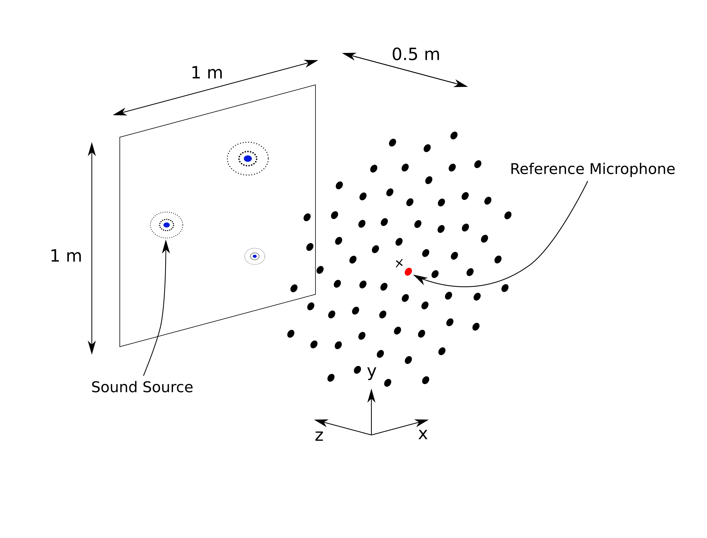

.. sectnum::

===============================================================================
AcouPipe Data Set- A Large-Scale Microphone Array Data Set for Machine Learning  
===============================================================================

.. contents:: 

Microphone Array Data Set
==========================

Data Set Characteristics
-------------------------

===================== ====================================  
Environment           unechoic, resting, homogeneous fluid
Microphone Array      Vogel's spiral, M=64, d=1m
===================== ====================================

Input Features
~~~~~~~~~~~~~~~~~~~~~~~~~~~~~

Labels
~~~~~~~~~~~~~~~~~~~~~~~~~~~~~

Simulate the Data with Docker
-----------------------------

Using Parallel Tasks
~~~~~~~~~~~~~~~~~~~~~~~~~~~~~

Distributed Simulation with SLURM
----------------------------------

Load the Data
------------------

H5 Data Set Structure
~~~~~~~~~~~~~~~~~~~~~~~~~~~~~

TFrecord Data Set Structure
~~~~~~~~~~~~~~~~~~~~~~~~~~~~~

* Loader class
* explain metadata

AcouPipe Toolbox
=================

Acoular_

.. _Acoular: http://www.acoular.org

Installation
------------------

Module Overview
------------------

Examples
------------------