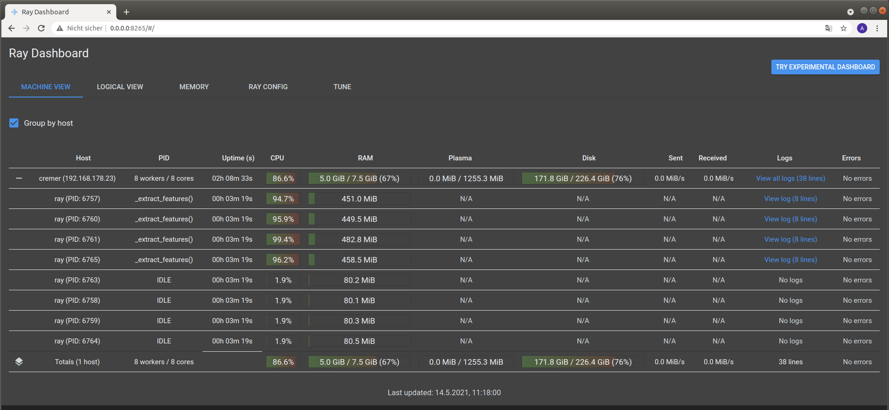

.. sectnum::

================================================================================
AcouPipe Data Set – A Large-Scale Microphone Array Data Set for Machine Learning  
================================================================================

.. contents:: 

Microphone Array Data Set
==========================

This repository provides a data set for source localization and characterization.
The synthetic data can be created by running a simulation process inside a Docker container.

.. image:: src/msm_layout.png

Data Set Characteristics
-------------------------

**fixed characteristics:**

===================== ========================================  
Environment           Unechoic, Resting, Homogeneous Fluid
Microphone Array      Vogel's spiral, M=64, Aperture Size 1m
Observation Area      :math:`x,y \in [-0.5,0.5], z=0.5`
Source Type           Monopole 
Source Signals        Uncorrelated White Noise (T=5s)
Sampling Rate         :math:`\mathit{He} = 40$, $F_s=13720\,$Hz` 
No. of Time Samples   68.600 
===================== ========================================

**sampled characteristics:**

==================================================================   ===================================================  
Sensor Position Deviation [m]                                        Normal distributed :math:`(\sigma = 0.001)`
No. of Sources                                                       Poisson distributed :math:`(\lambda=3)` 
Source Positions                                                     Normal distributed :math:`(\sigma = 0.1688)` 
Source Strength :math:`(\text{Pa}^2` at :math:`x_{\text{ref}})`      Rayleigh distributed :math:`(\sigma_{\text{R}}=5)`
==================================================================   ===================================================

Input Features
~~~~~~~~~~~~~~~~~~~~~~~~~~~~~

Labels
~~~~~~~~~~~~~~~~~~~~~~~~~~~~~

Simulate the Data with Docker
-----------------------------

The easiest way to create the data set is by using an existing
Docker image from DockerHub_. Simply pull the latest image with the command

.. code-block:: 

    docker pull adku1173/acoupipe:latest

The image contains the simulation source code and an up-to-date version of Acoular_, 
AcouPipe and Tensorflow_.
One can run the data set simulation given by the main.py script from inside the Docker container by typing

.. code-block:: 

    HOSTDIR="<enter the desired host directory>" # stores the data sets inside this directory
    NTASKS=<enter the number of parallel tasks> # should match the number of CPUs on the host
    docker run -it --user "$(id -u)":"$(id -g)" -v $HOSTDIR:/data/datasets adku1173/acoupipe python main.py --tasks=$NTASKS

Note that the current user on the host is specified as the user of the docker environment with the additional argument :code:`--user "$(id -u)":"$(id -g)"`.
It is not recommended to run the container as a root user.
Further, a directory where the data set files are stored needs to be binded to the container (:code:`HOSTDIR=<dir>`). With the 
:code:`HOSTDIR=$(pwd)` command, the current working directory on Linux or macOS hosts are binded. 
The simulation can be run on multiple CPU threads in parallel to speed up computations. The exact number of threads can be specified by the 
user with the :code:`--tasks` argument. 

After starting the main script, a progress bar should appear that logs the current simulation status:

.. code-block:: 

    1%|█▍                           | 83/10000 [01:04<1:40:35,  1.64it/s]

It is possible to view the CPU usage via a dashboard application served by the Ray_ API. One should find the following output at the beginning 
of the simulation process when running the simulation on multiple CPU threads

.. code-block:: 

    2021-05-14 08:50:16,533	INFO services.py:1267 -- View the Ray dashboard at http://0.0.0.0:8265

When running the simulation inside a Docker container it is necessary to forward the corresponding TCP port  with :code:`-p 8265:8265` to access the server serving the dashboard.
Now one can open the dashboard by accessing the web address http://0.0.0.0:8265 which should display the following web interface

The main.py script has some further command line options that can be used to influence the simulation process:

.. code-block::

    usage: main.py [-h]
                [--datasets {training,validation} [{training,validation} ...]]
                [--tsamples TSAMPLES] [--tstart TSTART] [--vsamples VSAMPLES]
                [--vstart VSTART] [--tpath TPATH] [--vpath VPATH]
                [--file_format {tfrecord,h5}] [--cache_dir CACHE_DIR]
                [--freq_index FREQ_INDEX] [--nsources NSOURCES]
                [--features {sourcemap,csmtriu,csm} [{sourcemap,csmtriu,csm} ...]]
                [--tasks TASKS] [--head HEAD] [--cache_csm] [--cache_bf]
                [--log]

    optional arguments:
    -h, --help            show this help message and exit
    --datasets {training,validation} [{training,validation} ...]
                            Whether to compute both data sets ('training
                            validation') or only the 'training' / 'validation'
                            data set. Defaults to compute training and validation
                            data set
    --tsamples TSAMPLES   Total number of training samples to simulate
    --tstart TSTART       Start simulation at a specific sample of the data set
    --vsamples VSAMPLES   Total number of validation samples to simulate
    --vstart VSTART       Start simulation at a specific sample of the data set
    --tpath TPATH         Path of simulated training data. Default is current
                            working directory
    --vpath VPATH         Path of simulated validation data. Default is current
                            working directory
    --file_format {tfrecord,h5}
                            Desired file format to store the data sets.
    --cache_dir CACHE_DIR
                            Path of cached data. Default is current working
                            directory
    --freq_index FREQ_INDEX
                            Returns only the features and targets for the
                            specified frequency index, default is None (all
                            frequencies will be calculated and included in the
                            data set)
    --nsources NSOURCES   Calculates the data set with a fixed number of
                            sources. Default is 'None', meaning that the number of
                            sources present will be sampled randomly.
    --features {sourcemap,csmtriu,csm} [{sourcemap,csmtriu,csm} ...]
                            Whether to compute data set containing the csm or the
                            beamforming map as the main feature. Default is 'csm'
    --tasks TASKS         Number of asynchronous tasks. Defaults to '1' (non-
                            distributed)
    --head HEAD           IP address of the head node in the ray cluster. Only
                            necessary when running in distributed mode.
    --cache_csm           Whether to cache the results of the CSM calculation
    --cache_bf            Whether to cache the results of the beamformer
                            calculation. Only relevant if 'sourcemap' is included
                            in --features list.
    --log                 Whether to log timing statistics to file. Only for
                            internal use.

Distributed Simulation with SLURM
----------------------------------

Load the Data
------------------

H5 Data Set Structure
~~~~~~~~~~~~~~~~~~~~~~~~~~~~~

TFrecord Data Set Structure
~~~~~~~~~~~~~~~~~~~~~~~~~~~~~

* Loader class
* explain metadata

AcouPipe Toolbox
=================

The AcouPipe module extends the computational 
pipeline-based concept of Acoular_ and provides additional 
tools that can be helpful to generate realizations 
of features in a predefined random process. 

Installation
------------------

Module Overview
------------------

The following UML flowchart gives a rough overview of AcouPipe's 
classes and their inheritance relationships. 

Sampler Module
~~~~~~~~~~~~~~~~~~~~~~~~~~~~~

A manipulation of object characteristics according to a certain 
random distribution can be achieved by the use of the :code:`BaseSampler` derived classes included in the :code:`sampler.py` module. 
All :code:`BaseSampler` derived classes are representing random processes that can be used to manipulate the attributes of Acoular's objects according to a specified distribution. 
A random process is defined by a random variable and a corresponding random state. Both properties are attributes of all :code:`BaseSampler` derived classes. 
AcouPipe offers a variety of different types of samplers in the :code:`sampler.py` module.
The random variable that can be passed to class instances of the sampler module must be an derived from or be part of the :code:`scipy.stats` module. 

This example illustrates how the RMS value of two white noise signals can be sampled according to a normal distribution. Therefore, an instance of the :code:`BaseSampler` 
derived :code:`NumericAttributeSampler` class is used. The two white noise signal objects are given as targets to the sampler object. 
New RMS values following a normal distribution are assigned to the :code:`WNoiseGenerator` objects each time the sample method of the :code:`NumericAttributeSampler` object is evaluated.    

.. code-block:: python

    import acoular
    import acoupipe
    from scipy.stats import norm

    random_var = norm(loc=1.,scale=.5)

    n1 = acoular.WNoiseGenerator( sample_freq=24000, 
                    numsamples=24000*5, 
                    rms=1.0,
                    seed=1 )

    n2 = acoular.WNoiseGenerator( sample_freq=24000, 
                    numsamples=24000*5, 
                    rms=.5,
                    seed=2 )

    rms_sampler = acoupipe.NumericAttributeSampler(
                    target=[n1,n2],
                    attribute='rms',
                    random_var=random_var,
                    random_state=10)

    rms_sampler.sample()

Pipeline Module
~~~~~~~~~~~~~~~~~~~~~~~~~~~~~    

Classes defined in the :code:`pipeline.py` module have the ability to iteratively perform tasks on the related computational pipeline to build up a data set. 
The results of these tasks are the features (and labels) associated with a specific sample of the data set. 
Feature creation tasks can be specified by passing callable functions that are evoked at each iteration of the :code:`BasePipeline`'s :code:`get_data()` generator method. 
It is worth noting that such a data generator can also be used directly to feed a machine learning model without saving the data to file. 
Common machine learning frameworks, such as Tensorflow_, offer the possibility to consume data from Python generators.
Control about the state of the sampling process is maintained via the :code:`sampler` attribute holding a list of :code:`BaseSampler` derived instances. 

.. code-block:: python

    def calculate_csm(powerspectra):
        return powerspectra.csm

    pipeline = acoupipe.BasePipeline(
        sampler=[rms_sampler],
        numsamples = 5,
        features={'csm' : (calculate_csm, ps),}
        )
            
    data_generator = pipeline.get_data()

Writer Module
~~~~~~~~~~~~~~~~~~~~~~~~~~~~~
Provides classes to store the data extracted by the pipeline. 
Current implementation includes a classes to save data into a 
container-like file format (.h5 file with the :code:`WriteH5Dataset` class) or binary format (.tfrecord file with the :code:`WriteTFRecord` class). 
The latter can be efficiently consumed by the Tensorflow framework for machine learning.

.. code-block:: python

    file_writer = acoupipe.WriteH5Dataset(
                source=pipeline,
                )
        
    file_writer.save()
    

Loader Module
~~~~~~~~~~~~~~~~~~~~~~~~~~~~~
The :code:`loader.py` module provides the :code:`LoadH5Dataset` class to load the data sets stored into .h5 files.

Examples
------------------

.. Links:

.. _Ray: https://docs.ray.io/en/master/
.. _Tensorflow: https://www.tensorflow.org/
.. _DockerHub: https://hub.docker.com/repository/docker/adku1173/acoupipe
.. _Acoular: http://www.acoular.org