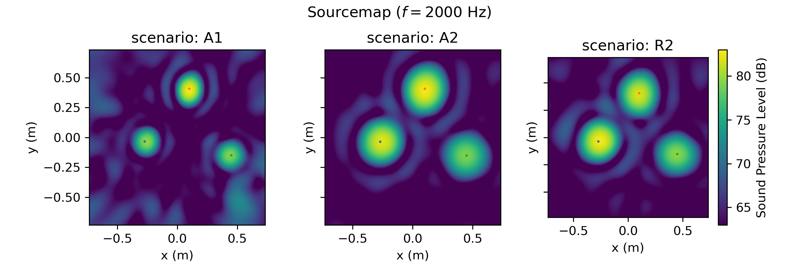

.. _dataset_miracle:

DatasetMIRACLE
==============

``DatasetMIRACLE`` is a microphone array dataset generator using experimentally measured spatial room impulse responses (SRIRs) from the `MIRACLE`_ dataset. The generator follows the same workflow as :class:`acoupipe.datasets.synthetic.DatasetSynthetic`, but uses measured transfer functions / impulse responses instead of analytic ones. Multi-source scenarios with possibly closing neighboring sources are realized by superimposing signals that have been convolved with the provided SRIRs.

.. figure:: ../../_static/msm_miracle.png
    :width: 750
    :align: center

    Measurement setup ``R2`` from the `MIRACLE`_ dataset.

Scenarios
---------

The MIRACLE dataset provides SRIRs from different measurement setups with the same microphone array, selectable via the :code:`scenario` parameter. The underlying measurement setup for :code:`scenario="R2"` is shown above.

.. list-table:: Available scenarios
    :header-rows: 1
    :widths: 5 10 10 10 10 10 10

    *   - Scenario
        - Download Size
        - Environment
        - c0
        - # SRIRs
        - Source-plane dist.
        - Spatial sampling
    *   - A1
        - 1.1 GB
        - Anechoic
        - 344.7 m/s
        - 4096
        - 73.4 cm
        - 23.3 mm
    *   - D1
        - 300 MB
        - Anechoic
        - 344.8 m/s
        - 4096
        - 73.4 cm
        - 5.0 mm
    *   - A2
        - 1.1 GB
        - Anechoic
        - 345.0 m/s
        - 4096
        - 146.7 cm
        - 23.3 mm
    *   - R2
        - 1.1 GB
        - Reflective Ground
        - 345.2 m/s
        - 4096
        - 146.7 cm
        - 23.3 mm

Default FFT parameters
----------------------

The underlying default FFT parameters are:

.. table:: FFT Parameters

    ===================== ========================================
    Sampling Rate         fs=32,000 Hz
    Block size            256 Samples
    Block overlap         50 %
    Windowing             von Hann / Hanning
    ===================== ========================================

Randomized properties
---------------------

Several properties of the dataset are randomized for each source case when generating the data. This includes the number of sources, their positions, and strength. Their respective distributions are closely related to :cite:`Herold2017`. Uncorrelated white noise is added to the microphone channels by default. Note that the source positions are sampled from a grid according to the spatial sampling of the MIRACLE dataset.

.. table:: Randomized properties

    ==================================================================   ===================================================
    No. of Sources                                                       Poisson distributed (:math:`\lambda=3`)
    Source Positions [m]                                                 Bivariate normal distributed (:math:`\sigma = 0.1688 d_a`)
    Source Strength (:math:`[{Pa}^2]` at reference position)               Rayleigh distributed (:math:`\sigma_{R}=5`)
    Relative Noise Variance                                              Uniform distributed (:math:`10^{-6}`, :math:`0.1`)
    ==================================================================   ===================================================

Example
-------

The following example script generates sourcemaps for several MIRACLE scenarios and is also used to create the figure below.

.. literalinclude:: ../script/experimental.py
   :language: python
   :caption: Example usage of DatasetMIRACLE
   :linenos:
   :end-before: dpath

The generator yields one sample at a time as a dictionary, including helper fields ``idx`` and ``seeds`` to keep data generation reproducible when running in parallel.

Example sourcemaps
------------------

The resulting plots for different scenarios can look like this:

API reference: :class:`acoupipe.datasets.experimental.DatasetMIRACLE`
