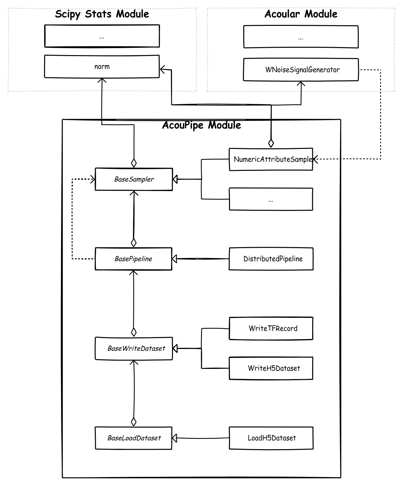

.. AcouPipe documentation master file, created by
   sphinx-quickstart on Fri May  7 19:16:33 2021.
   You can adapt this file completely to your liking, but it should at least
   contain the root `toctree` directive.

Welcome to AcouPipe documentation!
====================================

AcouPipe is a Python package that is intended to simplify the creation of microphone array data for machine learning.
The aim of the library is to generate large data sets according to specific distributions, properties and parameters. 
For the creation of acoustic data, the simulation capabilities of the `Acoular <http://www.acoular.org/>`_ Python library are required. 
To enable fast calculation, computations of data (or features) can be distributed to multiple CPUs and Nodes. Therefore AcouPipe uses the `Ray <https://docs.ray.io/en/master//>`_ core package under the hood.

Module Overview
----------------

The AcouPipe module consists of several files containing different tools that are explained in the following.

sampler.py 
^^^^^^^^^^  

All sampler classes are random processes that can be used to manipulate the attributes of different objects according to a specified distribution. 
A random process is defined by the settable properties random_var and random_state. 
The random variable that can be passed to class instances of the sampler module must be derived from or be part of the `scipy.stats <https://docs.scipy.org/doc/scipy/reference/stats.html/>`_ module.

pipeline.py 
^^^^^^^^^^^

Classes defined in the pipeline.py module have the task to iteratively extract/generate and pass a specified or unspecified amount of data. 
Control about the state of the sampling process is maintained via instances of the classes defined in the sampler module. 
Feature extraction tasks can be specified by passing callable functions that are evoked at each iteration.

writer.py 
^^^^^^^^^

Provides classes to store the data extracted by the pipeline. Current implementation includes a classes to save data to .h5 files and .tfrecord files.
The latter can be efficiently consumed by the `Tensorflow <https://www.tensorflow.org//>`_ framework for machine learning. 

loader.py 
^^^^^^^^^
Provides classes to load the datasets from file. Currently, only the loading of data stored in .h5 files is possible.

Content: 
========

.. toctree::
   :maxdepth: 1
   
   api_ref/index_apiref.rst

Indices and tables
==================

* :ref:`genindex`
* :ref:`modindex`
* :ref:`search`
