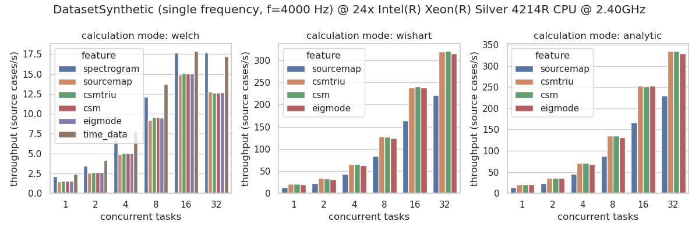
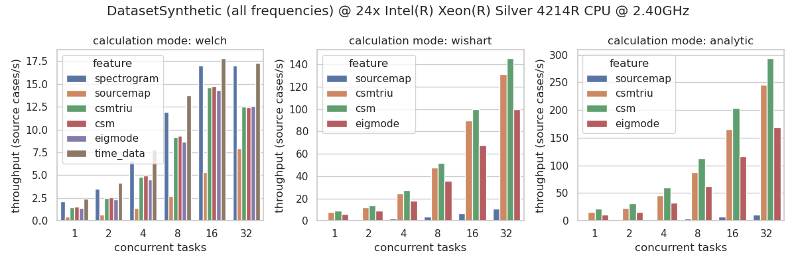
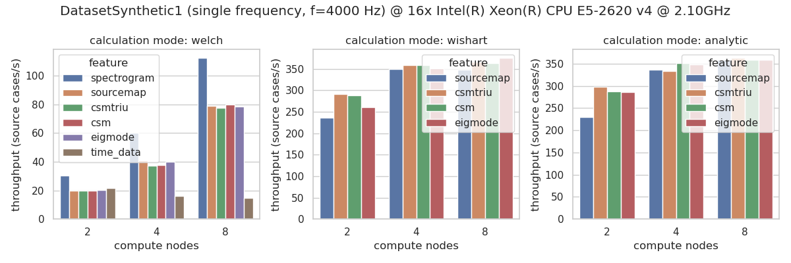

================================================================================
AcouPipe
================================================================================

**AcouPipe** :cite:`Kujawski2023` is a Python toolbox for generating unique acoustical source localization and characterization datasets with Acoular_ :cite:`Sarradj2017` that can be used for training of deep neural networks and machine learning. 

AcouPipe supports distributed computation with Ray_ and comes with two default datasets, which enables to create data for machine learning on the fly! A pre-built Docker container can be downloaded from DockerHub_.

.. toctree::
   :maxdepth: 1
   :caption: Contents

   contents/install.rst
   contents/datasets.rst
   contents/examples.rst
   contents/lit.rst
   AcouPipe API <../autoapi/acoupipe/index>

Data Generation 
===============

Currently, AcouPipe provides two default classes to generate microphone array datasets:

* **DatasetSynthetic** is a simple and fast method that relies on synthetic white noise signals and spatially stationary sources in anechoic conditions. This dataset has been used in the following publications: :cite:`Kujawski2019`, :cite:`Kujawski2022`, :cite:`Feng2022`.

* **DatasetMIRACLE** relies on a large-scale set of measured spatial room impulse responses, acquired at the TU Berlin anechoic chamber :cite:`Kujawski2023a`, and synthetic source signals resulting in a realistic and quasi-infinite dataset.

See the latest performance benchmarks on `DatasetSynthetic` for the most computational demanding features:

Depending on the computational complexity of the feature extraction task, dataset generation can be even distributed over multiple machines. Note that this is only useful if the extraction task is computationally demanding and the data that needs to be transferred between the nodes is not too large.
The following figure shows the speedup of the dataset generation for the `DatasetSynthetic` dataset on multiple compute nodes, each of which has 16 physical cores:

Citation 
========

Users can cite the package in their contributions by referring to :cite:`Kujawski2023`.
Here is an example citation in BibTeX format:

.. code-block:: bibtex

   @article{Kujawski2023,
   author = {Kujawski,Adam and Pelling, Art J. R. and Jekosch, Simon and Sarradj,Ennes},
   title = {A framework for generating large-scale microphone array data for machine learning},
   journal = {Multimedia Tools and Applications},
   year = {2023},
   doi = {10.1007/s11042-023-16947-w}
   }

License
=======

AcouPipe is licensed under the terms of the BSD license. See the file "LICENSE" for more information.

