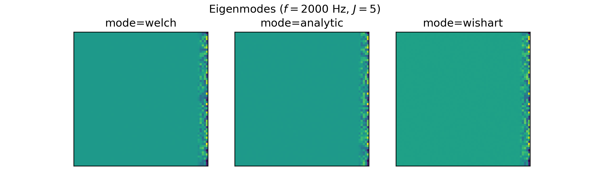

.. _features:

Features
========

By specifying the desired features, only the necessary data is stored.
This allows the user to create datasets of manageable size that are portable and facilitate reproducible research.
Depending on the users choice, the dataset comprises different features, explained the following.

**Notation**

Regarding the mathematical notation in this section, the following conventions are used:

* Boldface type for vectors and matrices, e.g., :math:`\mathbf{p}` represents a vector, while :math:`\mathbf{H}` denotes a matrix
* Blackboard Bold is used to indicate number spaces, e.g., :math:`\mathbb{C}` represents the complex number space 
.. * Calligraphic type for sets, e.g., :math:`\mathcal{G}` represents a set of ground-truth source characteristics

Microphone array sound pressure signals (:code:`'time_data'`)
--------------------------------------------------------------

The :code:`time_data` feature comprises the sound pressure signals :math:`p(t,\mathbf{r}_m)` at each microphone position :math:`\mathbf{r}_m`.
The data is stored in a Numpy array of shape (N,M), where N is the number of samples and M is the number of microphones.
The size of N depends on the signal length :code:`signal_length` and the sampling frequency :code:`fs`, which can both be set when creating a dataset e.g. with:

.. code-block:: python

    dataset = DatasetSynthetic1(signal_length=1.0,fs=16000)

.. note::
    The :code:`time_data` feature is only available if the choosen calculation mode is :code:`mode="welch"`. Otherwise, the time data is not simulated and can therefore not be used as a feature.

Microphone array spectrograms (:code:`'spectrogram'`)
-----------------------------------------------------

The :code:`spectrogram` feature comprises the complex-valued spectra :math:`P(f,\mathbf{r}_m)` of the microphone signals :math:`p(t,\mathbf{r}_m)` for several time data blocks. The data is stored in a Numpy array of shape (B,F,M), where B is the number of time data blocks, M is the number of microphones and F is the number of frequency bins. 
The number of time data blocks depends on the signal length :code:`signal_length`, FFT parameters and the sampling frequency :code:`fs`, which can all be set when creating a dataset e.g. with:

.. code-block:: python

    dataset = DatasetSynthetic1(signal_length=1.0,fs=16000)
    dataset.config.fft_params['block_size'] = 512
    dataset.config.fft_params['overlap'] = '50%''

.. note::
    The :code:`spectrogram` feature is only available if the choosen calculation mode is :code:`mode="welch"`. Otherwise, the underlying time data from which the spectra are calculated is missing.

Cross-spectral matrix (:code:`'csm'`) 
-------------------------------------

The :code:`csm` feature corresponds to the cross-spectral matrix (CSM) :math:`\mathbf{C}(f)`, which contains the auto-power and cross-power spectra of all sensors and is a complex-valued Hermitian matrix. The data is stored in a Numpy array of shape (F,M,M), where M is the number of microphones and F is the number of frequency bins. AcouPipe provides three different modes (:code:`analytic`, :code:`welch` and :code:`wishart`) to obtain the CSM. The default mode is :code:`welch`. A different mode can be set when creating a dataset e.g. with: 

.. code-block:: python

    dataset = DatasetSynthetic1(mode='analytic')

The representations only slightly differ, depending on the choosen CSM calculation mode (:code:`analytic`, :code:`welch` or :code:`wishart`), as can be seen for the following example extracted from `DatasetSynthetic1`:

estimated CSM from time data (:code:`mode="welch"`)
~~~~~~~~~~~~~~~~~~~~~~~~~~~~~~~~~~~~~~~~~~~~~~~~~~~~~~~~

Given :math:`M` spatially distributed receivers, :math:`J` uncorrelated and spatially stationary sources, and a linear propagation model, the complex sound pressure at the :math:`m`-th sensor is described by:

.. math::

   p(\mathbf{r}_{m}, \omega) = \sum_{j=1}^J h_{mj}(\omega) q(\mathbf{r}_{j}, \omega) + n(\boldsymbol{r}_{m}, \omega)

Here, :math:`\omega` is the angular frequency, :math:`h_{mj}` is the transfer function, and :math:`q(\mathbf{r}_{j}, \omega)` represents the complex-valued amplitude of the source. Independent noise is modeled as :math:`n(\boldsymbol{r}_{m}, \omega)`.
In practice, the CSM is estimated from a finite number of samples. One common method for estimating the CSM utilized by AcouPipe is Welch's method:

.. math::

   \hat{\mathbf{C}} = \frac{1}{B} \sum_{b=1}^{B} \mathbf{p} \mathbf{p}^{\text{H}}

To obtain the CSM with Welch's method requires to simulate the underlying microphone signals, which is computationally expensive. On the other hand it is the most realistic method to obtain the CSM. 

analytic CSM (:code:`mode="analytic"`)
~~~~~~~~~~~~~~~~~~~~~~~~~~~~~~~~~~~~~~~~~

The propagation equation can also be written in matrix form:

.. math::

   \mathbf{p} = \mathbf{H}\mathbf{q} + \mathbf{n}

with :math:`\mathbf{p} \in \mathbb{C}^{M}`, :math:`\mathbf{q} \in \mathbb{C}^{J}`, :math:`\mathbf{n} \in \mathbb{C}^{M}`, and :math:`\mathbf{H} \in \mathbb{C}^{M\times J}`

If the matrix :math:`\mathbb{E}[\mathbf{q} \mathbf{q}^{\text{H}}] = \mathbf{Q} \in \mathbb{C}^{J \times J}` containing the sources' auto- and cross-power spectra and the transfer matrix :math:`\mathbf{H} \in \mathbb{C}^{M \times J}` are known, the CSM can be calculated analytically as:

.. math::

   \mathbf{C} = \mathbb{E}[\mathbf{p}\mathbf{p}^{\text{H}}] = \mathbf{H} \mathbf{Q} \mathbf{H}^{\text{H}}

where :math:`\mathbb{E}[\cdot]` denotes the expectation operator. This enables a fast calculation of the CSM but neglects uncertainties that stem from a limited number of snapshots.

Wishart-distributed CSM (:code:`mode="wishart"`)
~~~~~~~~~~~~~~~~~~~~~~~~~~~~~~~~~~~~~~~~~~~~~~~~~

By assuming stationary sources with non-deterministic source signals, a snapshot deficient CSM can be sampled. 
Given the matrix :math:`\mathbf{Q}`, it is possible to approximate :math:`\mathbf{Q}` using the Cholesky decomposition :math:`\mathbf{Q}(\omega) = \mathbf{U}\mathbf{U}^{\mathsf{H}}` and the Bartlett decomposition:

.. math::

   \hat{\mathbf{Q}}  = \frac{1}{n} \mathbf{U} \mathbf{A} \mathbf{U}^{\mathsf{H}}

Here, :math:`\mathbf{A}` is generated for :math:`n` different degrees of freedom, representing the number of snapshots. The distribution of :math:`\mathbf{A}` follows a complex Wishart distribution :math:`\mathcal{W}_{\mathbb{C}} (n,\mathrm{I})`.

Sampling the cross-spectral matrix is then achieved by multiplying the Wishart-distributed source matrix with the transfer matrix :math:`\mathbf{H}`:

.. math::

   \hat{\mathbf{C}}_{\mathcal{W}} = \mathbf{H} \hat{\mathbf{Q}} \mathbf{H}^{\mathsf{H}}.

This method is computationally efficient and allows to sample the CSM for a varying number of snapshots with the same computational burden as with a single snapshot. However, the Wishart-distributed CSM is only an approximation of a snapshot deficient CSM.

Compressed Cross-spectral matrix (:code:`'csmtriu'`)
------------------------------------------------------------

The CSM is a complex Hermitian matrix and contains redundant information. By using :code:`features=['csmtriu']`, only the upper triangular part of the CSM is returned (the conjugate complex of the CSM is neglected; see :cite:`Castellini2021`). The data is stored in a real-valued Numpy array of shape (F,M,M), where M is the number of microphones and F is the number of frequency bins. Similarly as for the :code:`csm` feature, the representation depends on the choosen mode (:code:`analytic`, :code:`welch` or :code:`wishart`).

The representations only slightly differ, depending on the choosen CSM calculation mode (:code:`analytic`, :code:`welch` or :code:`wishart`), as can be seen for the following example extracted from `DatasetSynthetic1`:

Eigenmodes of the CSM (:code:`'eigmode'`)
------------------------------------------

The Eigenmodes of the cross-spectral matrix are the eigenvectors scaled by their corresponding eigenvalues and have been used in :cite:`Kujawski2022` as input features for source characterization. 

Eigen-decomposition is used to decompose the CSM into its eigenvalues and eigenvectors:

.. math::

   \hat{\mathbf{C}} = \mathbf{V}\mathbf{\Lambda}\mathbf{V}^{\text{H}}

Here, :math:`\mathbf{V}` contains the complex eigenvectors, and :math:`\mathbf{\Lambda}` is a diagonal matrix of eigenvalues. 
The exact representation depends on the choosen CSM calculation mode (:code:`analytic`, :code:`welch` or :code:`wishart`).

As can be observed from the Eigenspectrum of the CSM, the choice of the CSM calculation mode has an impact on the feature representation, in particular the scaling of the eigenmodes.

Sourcemap (:code:`'sourcemap'`)
--------------------------------

The conventional beamforming map is calculated by processing the CSM with the corresponding steering vector :math:`h`, such that  

.. math::

   b(\mathbf{x}_t) = \mathbf{h}^{\mathrm{H}}(\mathbf{x}_t) \mathbf{C h}(\mathbf{x}_t), \quad t \in \{1, \ldots, G\}.

The equation is evaluated for a spatial grid.

The conventional beamforming map is a feature with AcouPipe when the features attribute is set to :code:`features=['sourcemap']`.
For convenience, the sound radiation is assumed to come from a monopole. 
Different steering vector formulations exist in the literature, varying in terms of spatial precision and accuracy in determining the source strength. 
Formulation III according to :cite:`Sarradj2012` is used as the default, which is defined as:

.. math::

   h_m = \frac{1}{r_{t, 0} r_{t, m} \sum_{l=1}^M r_{t, l}^{-2}} \exp^{-\jmath k\left(r_{t, m}-r_{t, 0}\right)}

Here, :math:`r_{t, m}` refers to the distance between the steered location and the respective :math:`m`-th sensor, while :math:`r_{t, 0}` specifies the distance from the focus point to the reference point where the sound pressure is evaluated.
Sarradj demonstrated that using formulation III, the maximum sound pressure level depicted in a sound map may not precisely correspond to the true position of a single sound source. 
However, the study also revealed that the maximum does equal the true source strength for larger Helmholtz numbers.

The representation slightly differs, depending on the choosen CSM calculation mode (:code:`analytic`, :code:`welch` or :code:`wishart`), as can be seen for the following example extracted from `DatasetSynthetic1`:

Analytic source strength (:code:`'source_strength_analytic'`)
-------------------------------------------------------------

The analytic source strength refers to the expectation value (infinite number of snapshots) of the squared sound pressure amplitude :math:`\mathbb{E}[p^2_j(\mathbf{r}_0,f)]` with respect to a reference position :math:`\mathbf{r}_0`. 
The data is stored in a Numpy array of shape (F,J), where F is the number of frequency bins and J is the number of sources.
The reference position :math:`\mathbf{r}_0` is set to the microphone closest to the origin of the coordinate system by default. 

Estimated source strength (:code:`'source_strength_estimated'`)
---------------------------------------------------------------

The estimated source strength is the block-wise averaged squared sound pressure amplitude :math:`1/B p^2_j(\mathbf{r}_0,f)` with respect to a reference position :math:`\mathbf{r}_0`, where B is the number of time data blocks. The data is stored in a Numpy array of shape (F,J) with F beeing the number of frequency bins and J is the number of sources.
The reference position :math:`\mathbf{r}_0` is set to the microphone closest to the origin of the coordinate system by default. 

The representation of the estimated source strength slightly differs, depending on the choosen calculation mode (:code:`analytic`, :code:`welch` or :code:`wishart`). With :code:`mode='analytic'`, the estimated source strength equals the analytic source strength. With :code:`mode='welch'`, the estimated source strength is calculated according to Welch's method. With :code:`mode='wishart'`, the estimated source strength is a snapshot deficient approximation of the analytic source strength. 

Analytic noise power (:code:`'noise_strength_analytic'`)
---------------------------------------------------------

The analytic noise power refers to the expectation value (infinite number of snapshots) of the squared sound pressure amplitude :math:`\mathbb{E}[p^2(\mathbf{r}_m,f)]` at each m-th microphone. The data is stored in a Numpy array of shape (F,M), where F is the number of frequency bins and M is the number of microphones.

Estimated noise power (:code:`'noise_strength_estimated'`)
-----------------------------------------------------------

The estimated noise power is the block-wise averaged squared sound pressure amplitude :math:`1/B p^2(\mathbf{r}_m,f)` at each m-th microphone, where B is the number of time data blocks. The data is stored in a Numpy array of shape (F,M), where F is the number of frequency bins and M is the number of microphones. 

The representation of the estimated noise power slightly differs, depending on the choosen calculation mode (:code:`analytic`, :code:`welch` or :code:`wishart`). With :code:`mode='analytic'`, the estimated noise power equals the analytic noise power. With :code:`mode='welch'`, the estimated noise power is calculated according to Welch's method. With :code:`mode='wishart'`, the estimated noise power is a snapshot deficient approximation of the analytic noise power.

Sound source locations (:code:`'loc'`)
--------------------------------------

The spatial locations of the involved sound sources. The data is stored in a Numpy array of shape (3,J), where J is the number of sources. 

Frequencies of interest (:code:`'f'`)
-------------------------------------

The frequencies of interest given by the user when calling the :code:`generate(f=[...])` method. The data is stored in a Numpy array of shape (F,), where F is the number of frequency bins. 
The frequency included in the data might be slightly different from the specified frequency. This is due to the fact that the frequency is chosen from a discrete set of frequencies, which depends on the parameters of the FFT and the sampling rate :code:`fs` of the dataset. 

Frequency width (:code:`'num'`)
--------------------------------

The width of the frequency bands considered calling the :code:`generate(num=<num>)`. 

Source case index (:code:`'idx'`)
---------------------------------

The index referencing the sampled case in the dataset (default: starts at 0). A different start index can be set with the :code:`start_idx` argument when generating data, e.g. with:

.. code-block:: python

   ntasks = <number of parallel tasks>
   dataset = DatasetSynthetic1(tasks=ntasks)
   for data in dataset.generate(start_idx=100, ...):
         ...

When using multiple parallel tasks, the sample order may not be preserved. The :code:`idx` feature allows then to identify the source case in the dataset.

Random seeds (:code:`'seeds'`)
------------------------------

A list with random seeds used by the Sampler objects involved.
The combination is unique for each source case in the dataset. Primarily for internal use.

