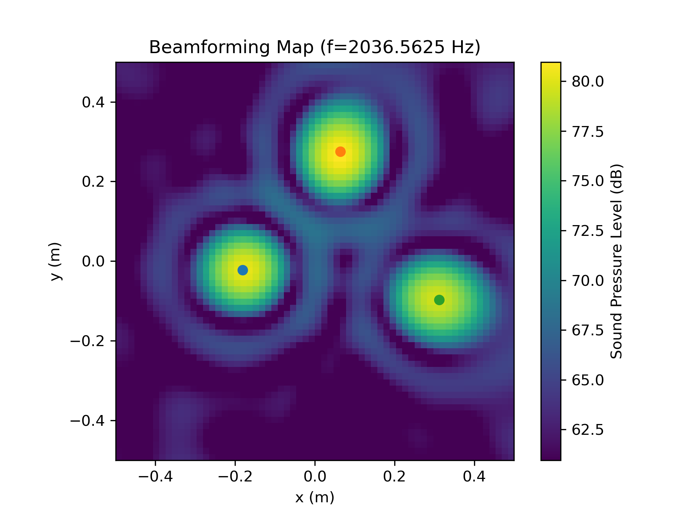

.. _quickstart:

Quickstart
==========

Generate Datasets 
-----------------

To generate microphone array data with one of the available dataset generators, the user needs to instantiate the respective class and call the method :meth:`generate` with the desired parameters. 

The following code snippet shows how to create a dataset generator:

.. code-block:: python

    from acoupipe.datasets.synthetic import DatasetSynthetic1
    
    dataset = DatasetSynthetic1()
    # generate data for frequency 2000 Hz (single frequency)
    data_generator = dataset.generate(
        size=10, split='training', features=['sourcemap','loc', 'f'], f=[2000], num=0)
                                          

The user has to specify the :code:`size` of the dataset, the dataset split :code:`split` and the :code:`features` to be extracted. A full list of available features can be found in the :ref:`Features section <features>`. Optionally, the user can specify certain frequencies :code:`f` and the desired bandwidth :code:`num`. If no frequencies are given, the dataset will be generated for all frequencies in the range :math:`[0, 1/fs]` Hz.

.. admonition:: Dataset Splits

    All datasets comprise the following independent splits:

    * :code:`training` dataset
    * :code:`validation` dataset 
    * :code:`test` dataset

    The size of each split can be freely chosen.
    

In this example, we choose the :code:`sourcemap` feature, which is a 2D beamforming map with the squared sound pressure amplitudes as values. Furthermore, we include the source locations :code:`loc` and frequencies :code:`f` as potential labels of the dataset. 

There are a few things to note when extracting data with the data generator: 

.. code-block:: python

    data_sample = next(data_generator)

First, the data generator returns a single sample at a time, consisting of a dictionary with the feature names as keys and the corresponding data as values. Second, the :code:`data_sample` dictionary includes two additional items, namely the :code:`idx` and :code:`seeds` of the sample. The :code:`idx` is the sample index and the :code:`seeds` are the random seeds used to generate the sample. Both are included for reproducible data generation, especially in multi-processing scenarios.

.. note::
    The frequency included in the data might be slightly different from the specified frequency. This is due to the fact that the frequency is chosen from a discrete set of frequencies, which depends on the parameters of the FFT and the sampling rate :code:`fs` of the dataset. 
    
The sampling rate and the FFT parameters can be adjusted the following way:

.. code-block:: python

    fs = 44100
    block_size = 4096
    dataset = DatasetSynthetic1(fs=fs)
    dataset.config.fft_params['block_size'] = block_size

Now, the data can be plotted, e.g. by using the `matplotlib`_ library:

.. code-block:: python

    import acoular as ac
    import matplotlib.pyplot as plt
    import numpy as np

    extent = dataset.config.grid.extend()

    # sound pressure level
    Lm = ac.L_p(data_sample['sourcemap']).T
    Lm_max = Lm.max()
    Lm_min = Lm.max() - 20

    # plot sourcemap
    plt.figure()
    plt.title(f'Beamforming Map (f={data_sample["f"][0]} Hz)')
    plt.imshow(Lm, vmax=Lm_max, vmin=Lm_min, extent=extent, origin='lower')
    plt.colorbar(label='Sound Pressure Level (dB)')
    # plot source locations
    for loc in data_sample['loc'].T:
        plt.scatter(loc[0], loc[1])
    plt.xlabel('x (m)')
    plt.ylabel('y (m)')
    plt.show()
    
The resulting plot should look like this:

A more in-depth example on how to generate the data, and how to create a TensorFlow-ready pipeline that produces data on the fly can be found in the :ref:`Model training with training data generated on the fly <Examples>` example.

Store Datasets 
--------------

The user can also save the datasets in two different file formats (HDF5_ or TFRecord_). 

HDF5 format
^^^^^^^^^^^

HDF5_ is a container-like format storing data in hierarchical order. 
Each case and the corresponding data is stored into a separate group of the file. 
The sample index acts as the group header. 

.. code-block:: bash

    └──'0'
        |── 'sourcemap'
        |── 'loc' 
        |── 'f' 
        |── 'seeds'
    └──'1'
        |── 'sourcemap'
        |── 'loc' 
        |── 'f' 
        |── 'seeds'
    └──...
        |   ...

The correct order is always maintained, which is important when multiple source cases are simulated in parallel tasks.

The following code snippet shows how to store the data in HDF5 format:

.. code-block:: python

    from acoupipe.datasets.synthetic import DatasetSynthetic1
    
    dataset = DatasetSynthetic1()
    dataset.save_h5(features=['sourcemap','loc', 'f'], 
                    split='training', size=10, f=[2000], num=0, 
                    name='/tmp/training_dataset.h5')

A more in-depth example on how to save and load the data, and how to create a TensorFlow-ready pipeline from file can be found in the :ref:`Save and load datasets stored in HDF5 file format <Examples>` example.

TFRecord format
^^^^^^^^^^^^^^^

The TFRecord_ file format is a binary file format to store sequences of data developed by Tensorflow_. 
In case of running the simulation with multiple CPU threads, the initial sampling order of the source cases may not be maintained in the file. 
However, the exact source case number can be figured out with the :code:`idx` and :code:`seeds` features when the file is parsed.

The following code snippet shows how to store the data in TFRecord format:

.. code-block:: python

    from acoupipe.datasets.synthetic import DatasetSynthetic1
    
    dataset = DatasetSynthetic1()
    dataset.save_tfrecord(features=['sourcemap','loc', 'f'], 
                          split='training', size=10, f=[2000], num=0, 
                          name='/tmp/training_dataset.tfrecord')

A more in-depth example on how to save and load the data, and how to create a TensorFlow-ready pipeline from file can be found in the :ref:`Save and load datasets stored in TFRecord file format <Examples>` example.

