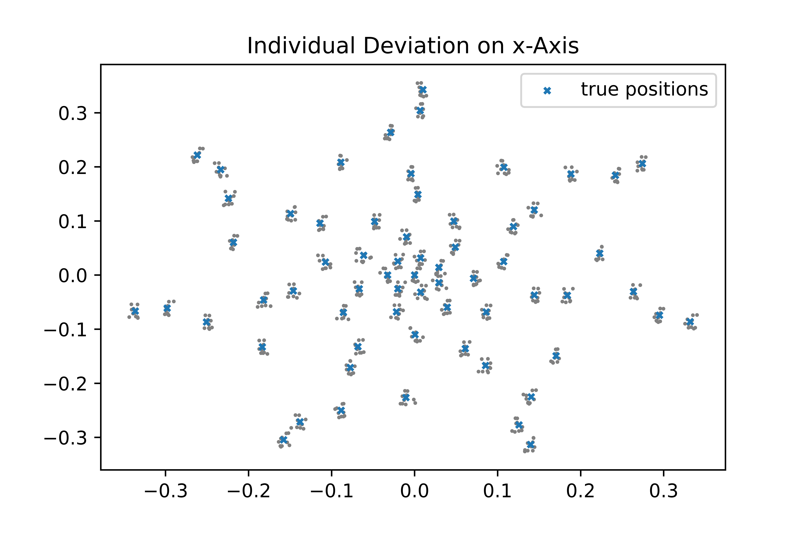

.. _example:

Example
===================================================

This example page will guide you through a brief introductory step-by-step example script and is intended to show some of the basic functionality of **AcouPipe**.

Prerequisites
-------------
It is assumed that **AcouPipe** along with all its dependencies, as well as NumPy_, SciPy_ and matplotlib_ are installed. Other than that, only a basic understanding of **Python** syntax is required.

Sampling Microphone Array Geometries
------------------------------------
One use case of **AcouPipe** is the sampling of a microphone array geometry.
Sampling means that, for a given array geometry, a number of samples with slight perturbations in the microphone positions is generated.
The purpose of **AcouPipe** is to generate large amounts of samples as quickly as possible, but for the sake of quick presentation, only a small number of samples is generated here.

First the necessary Python modules and objects are imported.

.. code-block:: Python

    import numpy as np
    import scipy
    from numpy.random import RandomState
    import matplotlib.pyplot as plt
    from acoular import MicGeom
    from acoupipe import MicGeomSampler

Then the number of samples to be generated is set,

.. code-block:: Python

    nsamples = 10

the Acoular_ microphone array geometry object is initialised

.. code-block:: Python

    mics = MicGeom(from_file="array64_d0o686.xml")

and a SciPy_ random distribution object is generated using a preset random seed in order to guarantee reproducibility.

.. code-block:: Python

    rng = RandomState(seed=1) 
    normal_distribution = scipy.stats.norm(loc=0, scale= 0.004) #scale=0.04/3.)

Using the above definitions, the **AcouPipe** sampler object is instantiated.

.. code-block:: Python

    mgs = MicGeomSampler(random_var=normal_distribution,
                        random_state=rng, 
                        target=mics)

This is then used to manipulate microphone positions according to various patterns:
Individual microphones are shifted along the x- and y-axis and the entire array is rotated, as well as shifted.
In the sequel, these deviatations are calculated, as well as displayed using matplotlib_.

To make individual microphone positions deviate along the x-axis only, the following code is used.

.. code-block:: Python

    mgs.ddir = np.array([[1.],[0],[0]])

    plt.figure()
    plt.title("individual deviation on x-axis")
    for _ in range(nsamples):
        mgs.sample()
        plt.scatter(mics.mpos[0], mics.mpos[1],marker="o",s=1,color="gray")
    plt.scatter(mgs.mpos_init[0], mgs.mpos_init[1],marker='x',s=10,label="true positions")
    plt.legend()    
    plt.show()

Note that, once the **AcouPipe** Sampler object is instantiated, it suffices to set some of its attributes, notably the *direction of deviation* :code:`mgs.ddir` and then simply call :code:`mgs.sample()`.
It is also possible to make individual microphone positions deviate along the x-axis, as well as the y-axis, as follows.

.. code-block:: Python

    mgs.ddir = np.array([[1.],[0.5],[0]])

    plt.figure()
    plt.title("individual deviation on x- and y- axis")
    for _ in range(nsamples):
        mgs.sample()
        plt.scatter(mics.mpos[0], mics.mpos[1],marker="o",s=1,color="gray")
    plt.scatter(mgs.mpos_init[0], mgs.mpos_init[1],marker='x',s=10,label="true positions")
    plt.legend()    
    plt.show()

.. figure:: ../_static/example_2.png
    :width: 780

Rotating the entire array around the z-axis is done using the *rotation vector* attribute :code:`mgs.rvec`.

.. code-block:: Python

    mgs.ddir = np.array([[0.0],[0.0],[0.0]]) # no individual deviation

    # for additional rotation around z-axis
    mgs.rvec = np.array([[0], [0], [1]])

    plt.figure()
    plt.title("rotation around z-axis")
    for _ in range(nsamples):
        mgs.sample()
        plt.scatter(mics.mpos[0], mics.mpos[1],marker="o",s=1,color="gray")
    plt.scatter(mgs.mpos_init[0], mgs.mpos_init[1],marker='x',s=10,label="true positions")
    plt.legend()    
    plt.show()

.. figure:: ../_static/example_3.png
    :width: 780

Finally, the *direction of translation* attribute :code:`mgs.tdir` can be set in order to translate the entire array. Here, it is shifted along the y-axis.
Note that the *rotation vector* attribute :code:`mgs.rvec` needs to be set to zero again.

.. code-block:: Python

    mgs.rvec = np.array([[0], [0], [0]])
    mgs.tdir = np.array([[0], [2.], [0]])

    plt.figure()
    plt.title("translation of full geometry along y-axis")
    for _ in range(nsamples):
        mgs.sample()
        plt.scatter(mics.mpos[0], mics.mpos[1],marker="o",s=1,color="gray")
    plt.scatter(mgs.mpos_init[0], mgs.mpos_init[1],marker='x',s=10,label="true positions")
    plt.legend()    
    plt.show()

.. figure:: ../_static/example_4.png
    :width: 780

Generating samples with **AcouPipe** can be as simple as that. The etire script can be found at :download:`micgeom_sampling_example.py <../../../examples/micgeom_sampling_example.py>`.