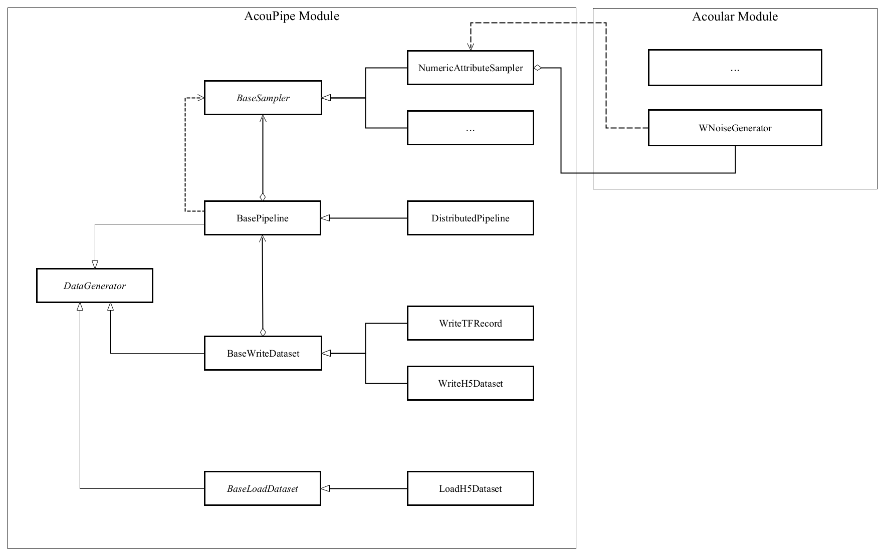

.. AcouPipe documentation master file, created by
   sphinx-quickstart on Fri May  7 19:16:33 2021.
   You can adapt this file completely to your liking, but it should at least
   contain the root `toctree` directive.

Welcome to AcouPipe documentation!
====================================

AcouPipe is a Python package that is intended to simplify the creation of microphone array data for machine learning.
The aim of the library is to generate large data sets according to specific distributions, properties and parameters. 
For the creation of acoustic data, the simulation capabilities of the `Acoular <http://www.acoular.org/>`_ Python library are required. 
To enable fast calculation, computations of data (or features) can be distributed to multiple CPUs and Nodes. Therefore AcouPipe uses the `Ray <https://docs.ray.io/en/master//>`_ core package under the hood.

Installation
------------------

Module Overview
------------------

The following UML flowchart gives a rough overview of AcouPipe's 
classes and their inheritance relationships. 

Sampler Module
~~~~~~~~~~~~~~~~~~~~~~~~~~~~~

A manipulation of object characteristics according to a certain 
random distribution can be achieved by the use of the :code:`BaseSampler` derived classes included in the :code:`sampler.py` module. 
All :code:`BaseSampler` derived classes are representing random processes that can be used to manipulate the attributes of Acoular's objects according to a specified distribution. 
A random process is defined by a random variable and a corresponding random state. Both properties are attributes of all :code:`BaseSampler` derived classes. 
AcouPipe offers a variety of different types of samplers in the :code:`sampler.py` module.
The random variable that can be passed to class instances of the sampler module must be an derived from or be part of the :code:`scipy.stats` module. 

This example illustrates how the RMS value of two white noise signals can be sampled according to a normal distribution. Therefore, an instance of the :code:`BaseSampler` 
derived :code:`NumericAttributeSampler` class is used. The two white noise signal objects are given as targets to the sampler object. 
New RMS values following a normal distribution are assigned to the :code:`WNoiseGenerator` objects each time the sample method of the :code:`NumericAttributeSampler` object is evaluated.    

.. code-block:: python

    import acoular
    import acoupipe
    from scipy.stats import norm

    random_var = norm(loc=1.,scale=.5)

    n1 = acoular.WNoiseGenerator( sample_freq=24000, 
                    numsamples=24000*5, 
                    rms=1.0,
                    seed=1 )

    n2 = acoular.WNoiseGenerator( sample_freq=24000, 
                    numsamples=24000*5, 
                    rms=.5,
                    seed=2 )

    rms_sampler = acoupipe.NumericAttributeSampler(
                    target=[n1,n2],
                    attribute='rms',
                    random_var=random_var,
                    random_state=10)

    rms_sampler.sample()

Pipeline Module
~~~~~~~~~~~~~~~~~~~~~~~~~~~~~    

Classes defined in the :code:`pipeline.py` module have the ability to iteratively perform tasks on the related computational pipeline to build up a data set. 
The results of these tasks are the features (and labels) associated with a specific sample of the data set. 
Feature creation tasks can be specified by passing callable functions that are evoked at each iteration of the :code:`BasePipeline`'s :code:`get_data()` generator method. 
It is worth noting that such a data generator can also be used directly to feed a machine learning model without saving the data to file. 
Common machine learning frameworks, such as Tensorflow_, offer the possibility to consume data from Python generators.
Control about the state of the sampling process is maintained via the :code:`sampler` attribute holding a list of :code:`BaseSampler` derived instances. 

.. code-block:: python

    def calculate_csm(powerspectra):
        return powerspectra.csm

    pipeline = acoupipe.BasePipeline(
        sampler=[rms_sampler],
        numsamples = 5,
        features={'csm' : (calculate_csm, ps),}
        )
            
    data_generator = pipeline.get_data()

Writer Module
~~~~~~~~~~~~~~~~~~~~~~~~~~~~~
Provides classes to store the data extracted by the pipeline. 
Current implementation includes a classes to save data into a 
container-like file format (.h5 file with the :code:`WriteH5Dataset` class) or binary format (.tfrecord file with the :code:`WriteTFRecord` class). 
The latter can be efficiently consumed by the Tensorflow framework for machine learning.

.. code-block:: python

    file_writer = acoupipe.WriteH5Dataset(
                source=pipeline,
                )
        
    file_writer.save()
    

Loader Module
~~~~~~~~~~~~~~~~~~~~~~~~~~~~~
The :code:`loader.py` module provides the :code:`LoadH5Dataset` class to load the data sets stored into .h5 files.

Examples
------------------

.. Links:

.. _SLURM: https://slurm.schedmd.com/quickstart.html
.. _Singularity: https://sylabs.io/guides/3.0/user-guide/quick_start.html
.. _Ray: https://docs.ray.io/en/master/
.. _`Ray Cluster`: https://docs.ray.io/en/master/cluster/index.html
.. _Tensorflow: https://www.tensorflow.org/
.. _`Tensorflow Dataset API`: https://www.tensorflow.org/api_docs/python/tf/data/Dataset#from_generator
.. _TFRecord: https://www.tensorflow.org/tutorials/load_data/tfrecord
.. _DockerHub: https://hub.docker.com/repository/docker/adku1173/acoupipe
.. _Acoular: http://www.acoular.org
.. _HDF5: https://portal.hdfgroup.org/display/HDF5/HDF5

Content: 
========

.. toctree::
   :maxdepth: 1
   
   api_ref/index_apiref.rst

Indices and tables
==================

* :ref:`genindex`
* :ref:`modindex`
* :ref:`search`
